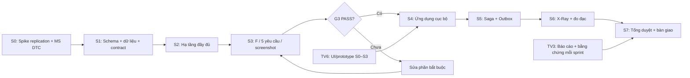

# PTIT One — Phân công 6 người từ Sprint 0 đến bàn giao

> **Trạng thái: kế hoạch để nhóm triển khai, chưa phải kết quả đã thực hiện.**
> Phiên lập kế hoạch này chỉ viết tài liệu, không sinh thêm code.
> Nguồn thiết kế kỹ thuật: [PTIT-One-Thiet-Ke.md](PTIT-One-Thiet-Ke.md),
> đặc biệt 0.1/0.1b, C8–C10, D3–D8, F, G và J.
> File này quản lý phân công và nghiệm thu; không thay thế hoặc tự sửa specs.

## 1. Phạm vi và lịch chung

**Giả định để lập lịch:** 8 tuần, mỗi sprint 1 tuần; Sprint 0 chính là tuần 1,
không cộng thêm một tuần chuẩn bị. Chưa gán ngày cụ thể vì chưa có ngày bắt đầu
và hạn nộp. Nếu lịch môn học thay đổi, nhóm đổi ngày và sức chứa sprint,
giữ nguyên thứ tự phụ thuộc và các cổng nghiệm thu.

**Điểm xuất phát:** nhóm đang chuẩn bị thiết kế/design pattern. Script nháp
có trong repo là đầu vào để review; không tính là đã cài đặt, đã kiểm thử
runtime hoặc đã hoàn thành sprint. Không đánh dấu Done từ một lần `-WhatIf`.

| Sprint | Tuần | Mục tiêu | Mốc cuối sprint |
|---|---|---|---|
| **S0** | 1 | Phân vai, phạm vi, thiết kế tổng quan, thử khả thi replication + MS DTC | **G0:** hai thử nghiệm kỹ thuật có bằng chứng |
| **S1** | 2 | Schema, phân mảnh, dữ liệu và thiết kế chi tiết | **G1:** thiết kế nhất quán, dữ liệu đủ cho kiểm chứng |
| **S2** | 3 | Dựng đầy đủ topology, replication, Linked Server, MS DTC | **G2:** hạ tầng ba site vận hành và tái dựng được |
| **S3** | 4 | Trigger, quyền, transaction, concurrency, distributed query | **G3:** năm yêu cầu bắt buộc + Phần F PASS, đủ screenshot |
| S4 | 5 | Ứng dụng nền tảng, sau G3 | **G4:** các luồng cục bộ hoạt động từ UI đến CSDL |
| S5 | 6 | Đăng ký liên cơ sở, hủy, Outbox và mirror | **G5:** retry/hủy/đồng bộ giữ đúng bất biến |
| S6 | 7 | X-Ray, đo đạc, kiểm thử sự cố | **G6:** số liệu và giới hạn có bằng chứng |
| **S7** | 8 | Sửa lỗi cuối, báo cáo, slide, tổng duyệt và bàn giao | **G7:** gói nộp hoàn chỉnh, tổng duyệt hai lần |

**Ưu tiên:** S0–S3 và hồ sơ nộp là bắt buộc. S4–S6 là phần ứng dụng mở rộng,
chỉ triển khai khi G3 đạt. Trong S0–S3, thiết kế giao diện/prototype được làm
song song; chưa nối API hoặc viết logic ứng dụng. Hiện tại chỉ lập kế hoạch
cho những việc này, không thực thi cài đặt hay phát triển.

## 2. Sáu vai trò và trách nhiệm

Điền tên thật tại Sprint Planning 0. Mỗi vai có người chịu trách nhiệm chính
và người dự phòng; dự phòng phải đọc tài liệu và thử lại phần bàn giao.

| Mã | Thành viên | Trách nhiệm chính | Dự phòng/review kỹ thuật |
|---|---|---|---|
| **TV1** | … | Hạ tầng: máy chủ, VPN, SQL Server, Agent, replication, Linked Server, MS DTC | TV2 |
| **TV2** | … | CSDL: schema, khóa/ràng buộc, trigger, role, stored procedure, dữ liệu kiểm thử | TV1; TV4 review bất biến |
| **TV3** | … | Tài liệu toàn thời gian: A–C, báo cáo F/G, nguồn trích dẫn, biên bản, hồ sơ screenshot | TV4 |
| **TV4** | … | Kiến trúc, ERD, phân mảnh/ánh xạ/định vị; điều phối tích hợp, QA, benchmark | TV5; TV2 review schema |
| **TV5** | … | Thiết kế backend; sau G3 làm API, routing, nghiệp vụ, saga, Outbox và trace | TV4 |
| **TV6** | … | UI/UX, design system, prototype; sau G3 làm frontend, trạng thái lỗi và màn demo | TV5 review tích hợp; TV3 review nội dung |

- **TV3 không kiêm code.** Người thực hiện kỹ thuật tự viết ghi chú và chụp
  bằng chứng; TV3 biên tập, kiểm tính đủ và gắn vào báo cáo.
- **TV4 điều phối, không nhận thay tất cả việc tích hợp.** Chủ module sửa lỗi
  của module mình; TV4 quản lý ca nghiệm thu và xác nhận lại kết quả.
- **TV5 và TV6 cùng phụ trách ứng dụng**, có hợp đồng API thống nhất từ S1;
  frontend không chờ backend để thiết kế trải nghiệm.
- Nhóm chỉ định người giữ từng máy MASTER/HCM, HN, DN và khung giờ bật máy
  trong S0. Đây là trách nhiệm vận hành riêng, không suy ra từ mã thành viên.

### Sức chứa và cách nhận việc

Đầu mỗi sprint, từng người khai báo số giờ thực sự có; không giả định sáu
người làm toàn thời gian. Chỉ cam kết khoảng **80% quỹ giờ**, để phần còn lại
cho review, tích hợp và lỗi môi trường. Đây là quy ước lập lịch của nhóm,
không phải số đo năng suất hay cam kết ngày hoàn thành.

Mỗi dòng phân công dưới đây là một gói việc. Nếu vượt sức chứa, tách thành
các task tối đa khoảng một ngày làm việc; giữ **một người chính/task**,
ghi người review và đầu ra cụ thể. Không chia tỷ lệ đóng góp theo số dòng code.

## 3. Design pattern: dùng để giải quyết việc gì

Đây là bản đồ triển khai từ C8/J, không phải danh sách pattern để thêm vào
dự án. S0–S1 bàn giao sơ đồ, trách nhiệm, hợp đồng và ca kiểm thử;
chỉ hiện thực ứng dụng từ S4 sau G3.

| Mẫu/cơ chế | Vị trí và tác dụng | Phụ trách | Thiết kế → hiện thực | Bằng chứng cần có |
|---|---|---|---|---|
| **Ports & Adapters + modular monolith** | Tách use case khỏi SQL Server; đúng 3 port: `CrossSiteQuery`, `GlobalReport`, `CatalogHealth` | TV4 + TV5 | S0–S1 → S4 | Sơ đồ phụ thuộc; domain không import Spring/JDBC; controller không gọi thẳng infrastructure |
| **Repository** | Gom SQL theo aggregate; JdbcTemplate cho đường nóng, báo cáo và truy vấn chéo site | TV5 + TV2 | S1 → S4 | Mỗi thao tác chỉ ra được SQL và transaction tại site nào; không sinh thêm port/factory |
| **Routing DataSource + Context Object** | `SiteContext`/registry định tuyến từ danh bạ và JWT đã ký | TV5 | S1 → S4 | Định tuyến đúng Home; không tin `campus` từ client; một transaction chỉ dùng một site |
| **Saga điều phối** | Home giữ yêu cầu/quyền môn/tín chỉ, Host giữ lớp và ghi danh | TV5 + TV2 | S1 → S5 | Sequence đăng ký/hủy/timeout; kết quả chưa rõ không được trả tín chỉ |
| **Idempotent Receiver** | `KetQuaXuLyYeuCau` lưu thành công, từ chối và tombstone hủy | TV2 + TV5 | S1 → S5 | Retry cùng `MaYeuCau` không chiếm thêm chỗ; hủy đến trước vẫn chặn đăng ký muộn |
| **Transactional Outbox** | Ghi điểm và sự kiện cùng giao dịch Host; worker chuyển về Home | TV5 + TV2 | S1 → S5 | Chết giữa upsert và SENT vẫn gửi lại được; `Version` ngăn sự kiện cũ ghi đè |
| **Read Model / Projection** | Snapshot lớp và `BangDiemMirror` phục vụ đọc khi site kia tắt | TV5 + TV6 | S1 → S5 | UI ghi thời điểm đồng bộ; chỉ mirror dữ liệu sinh viên thuộc Home |
| **Strategy** | Hai adapter của `GlobalReport`: Linked Server và backend merge; four-part/OPENQUERY là đối chứng SQL | TV4 + TV5 | S1 → S6 | Cùng dữ liệu đầu vào và kết quả; đo từng chiến lược, không đoán cái nào nhanh hơn |
| **Proxy / Decorator** | Bọc DataSource để ghi trace mà không sửa từng repository | TV5 + TV4 | S1 → S6 | Trace chỉ đúng site đã chạm; số đo và số suy ra có nhãn riêng |
| **Vòng xử lý chung của worker** | `OutboxWorker` giữ thứ tự đọc → xử lý → ghi nhận kết quả; J1 gọi là Template Method nhẹ | TV5 | S1 → S5 | Dùng class cụ thể; không dựng cây kế thừa chỉ để có tên pattern |
| **Graceful Degradation** | Báo cáo trả phần dữ liệu còn lấy được khi một site lỗi | TV5 + TV6 | S1 → S6 | Báo rõ site thiếu; không hiển thị tổng thiếu dữ liệu như tổng toàn trường |
| **Feature-Sliced + design tokens** | `app → features → shared`; API client dùng chung, error boundary theo feature | TV6 | S0–S2 → S4 | Feature không import lẫn nhau; token nhất quán; lỗi một phần không làm trắng trang |

**Hai phân biệt bắt buộc trong design review:**

1. **2PC/MS DTC là cơ chế giao dịch phân tán**, dùng cho chuyển cơ sở sinh
   viên tại D8. Đăng ký liên cơ sở dùng saga; không đưa 2PC vào đường đăng ký.
2. `LichHocMirror` tham gia kiểm trùng lịch, phải ghi **ngay lúc giữ quyền**
   tại Home. Nó có yêu cầu nhất quán khác `BangDiemMirror` chỉ phục vụ đọc.

**Không bổ sung:** microservices, Kafka/RabbitMQ, Redis, Kubernetes, replication
hai chiều, port thứ tư, Factory/RepositoryFactory/DatabaseProvider hoặc bảng
CRUD không phục vụ khái niệm phân tán trong specs.

### Các điểm cần chốt trước khi hiện thực nghiệp vụ

| Điểm cần làm rõ | Người chuẩn bị | Hạn | Cách xử lý |
|---|---|---|---|
| PK `DangKyMonHoc` và filtered index cùng bộ ba cột | TV2 + TV4 | S1 | PK chặn dòng thứ hai ở mọi trạng thái; chốt tái sử dụng dòng hay đổi khóa để lưu lịch sử. Đổi thiết kế phải ghi quyết định vào 0.1 |
| PK lịch không chứa khoảng tuần | TV2 + TV6 | S1 | Xác nhận v1 có cần hai khoảng tuần cùng lớp/thứ/tiết bắt đầu không; không tự thêm khóa |
| Công thức điểm, ngưỡng đạt, trần tín chỉ, học lại | TV3 + TV5 | S1 | Đối chiếu quy chế; giá trị giả định phải được ghi nhãn, không trình bày như quy định đã xác nhận |
| Enum trạng thái SV/lớp/đợt và đồng bộ mirror | TV5 + TV2 | S1 | Thống nhất bảng trạng thái trước schema/API; trạng thái saga giữ đúng bộ đã chốt |
| Số máy, named/default instance và nơi đặt Master | TV1 | D10/D12: S0; D15: S2 | Có kết quả spike và lịch dùng máy; dự phòng 2 site phải có biên bản chấp thuận |

## 4. Sprint 0 — Khởi động và thử khả thi (tuần 1)

**Mục tiêu:** mọi người hiểu năm yêu cầu của môn học; phát hiện rủi ro máy/mạng
trước khi đầu tư vào ứng dụng. Spike thực hiện trong ngày 1–3 khi sprint bắt đầu.

| Task | Người chính | Công việc | Đầu ra/điều kiện nhận |
|---|---|---|---|
| S0-01 | TV1 | Kiểm kê máy, VPN, SQL Server Developer, Agent, snapshot share; cùng TV2 thử replication và MS DTC | Danh sách người giữ máy/giờ bật máy; bằng chứng INSERT ở A xuất hiện ở B trong ≤10 giây; giao dịch MS DTC thử nghiệm chạy được |
| S0-02 | TV2 | Đối chiếu schema với C1/I6, chuẩn bị dữ liệu tối thiểu cho spike và bảng bất biến | Danh sách 15 bảng có ownership/PK/FK; phân biệt nguồn/replica/mirror; ghi điểm còn mâu thuẫn |
| S0-03 | TV3 | Thu yêu cầu đề bài, phân công môn, nguồn và giả định; lập dàn ý A–C, bảng tần suất B2 | Ma trận 5 yêu cầu → mục báo cáo → bằng chứng; nguồn hoặc nhãn giả định cho từng số liệu |
| S0-04 | TV4 | Vẽ tổng quan Master/Home/Host, nháp ERD; điều phối nhận việc và review spike | Sơ đồ một chiều replication, đường 2PC và saga riêng; bảng người review; kết luận G0 có bằng chứng |
| S0-05 | TV5 | Thiết kế ranh giới backend và các luồng đăng nhập, đăng ký cục bộ, liên cơ sở, chuyển cơ sở | Danh sách use case; sơ đồ đúng 3 port; mỗi bước đọc/ghi được gắn site, chưa viết API |
| S0-06 | TV6 | Khảo sát nhu cầu bốn vai trò, luồng màn hình và hướng thẩm mỹ cùng nhóm | User flow, wireframe, danh sách trạng thái loading/empty/error/đang xử lý; thống nhất tên PTIT One |

**G0:** TV1 cung cấp bằng chứng của cả replication và MS DTC; TV4 đối chiếu,
TV3 lưu vào hồ sơ. Nếu một thử nghiệm chưa PASS, ghi nguyên nhân và phương án
dự phòng theo I2, tiếp tục xử lý hạ tầng. UI/tài liệu độc lập vẫn tiến hành;
không tuyên bố đã qua cổng hoặc mở việc ứng dụng để bù tiến độ.

## 5. Sprint 1 — Thiết kế chi tiết, schema và dữ liệu (tuần 2)

**Phụ thuộc:** spike G0 cho phương án triển khai đã chọn. Mọi thay đổi specs
phải được nhóm ghi nhận trước khi hiện thực phần phụ thuộc.

| Task | Người chính | Công việc | Đầu ra/điều kiện nhận |
|---|---|---|---|
| S1-01 | TV1 | Chuẩn hóa topology/config, bốn database và thủ tục dựng/gỡ; chuẩn bị snapshot ban đầu cho schema site | Người khác làm theo được; tạo bảng tham chiếu và áp snapshot trước FK site; không áp lại snapshot DROP khi còn FK phụ thuộc |
| S1-02 | TV2 | Review/hoàn thiện schema, PK/FK/CHECK/index và seed theo C1/C9/G1 | Schema 15 bảng được đối chiếu; ghi danh khách không FK tới SV cục bộ; dữ liệu seed có số lượng, phân bố và phương án tạo lại |
| S1-03 | TV3 | Hoàn chỉnh bản A–B và mô tả C1–C5; xác minh giả định học vụ | Dẫn nguồn, thuật ngữ thống nhất; mô tả bằng văn bản khớp ERD và bảng ownership |
| S1-04 | TV4 | Chốt ERD, phân mảnh dẫn xuất, ánh xạ/định vị; review khóa và thiết kế tương tranh | Bộ sơ đồ và ca kiểm tra bất biến; mọi điểm ở bảng cần chốt có quyết định hoặc ghi rõ phần bị chặn |
| S1-05 | TV5 | Thiết kế sequence transaction, saga/hủy, Outbox, định tuyến JWT; hợp đồng API với TV6 | Ma trận endpoint/DTO/lỗi/quyền, ranh giới transaction, chính sách timeout/retry; chưa sinh backend |
| S1-06 | TV6 | Thiết kế token, component và prototype đăng nhập/lịch/đăng ký/điểm | Prototype có dữ liệu mẫu được ghi nhãn; TV5 review hợp đồng; TV3 review cách diễn đạt trạng thái |

**G1:** sơ đồ, tên bảng/cột, khóa và luồng nghiệp vụ khớp specs; có kế hoạch
seed quy mô G1 và dữ liệu nhỏ cho ca lỗi. Mâu thuẫn chưa giải quyết phải chặn
đúng task phụ thuộc, không tự suy diễn thành thay đổi thiết kế.

## 6. Sprint 2 — Cài đặt hạ tầng đầy đủ (tuần 3)

**Mục tiêu:** triển khai lặp lại được trên ba site đã chọn; đây là phần cài
đặt CSDL, chưa phải phát triển ứng dụng. Tài liệu thiết kế đi cùng bằng chứng.

| Task | Người chính | Công việc | Đầu ra/điều kiện nhận |
|---|---|---|---|
| S2-01 | TV1 | Hoàn thiện F1–F6: VPN, Agent, replication, Linked Server, MS DTC | Kiểm tra subscription HCM thành công trước HN/DN; đo end-to-end; cấu hình retention theo specs; chụp từng bước |
| S2-02 | TV2 | Áp schema/seed lên từng site, kiểm tra khóa và khả năng chạy lại; chuẩn bị dữ liệu F7 | Bảng/dữ liệu đúng mảnh; chạy lại không nhân đôi seed; script nháp được thử runtime và sửa theo lỗi thật |
| S2-03 | TV3 | Viết hướng dẫn F1–F6 từ thao tác đã thực hiện, quản lý bằng chứng | Từng bước có máy thực hiện, cấu hình đã dùng, ảnh và kết quả; che mật khẩu/token trước khi lưu |
| S2-04 | TV4 | Review độc lập topology; kiểm tra phân mảnh/replica, xây ma trận kiểm thử F7/G3 | Danh sách ca có đầu vào/kỳ vọng/cách đối soát; kết luận G2, ghi mọi ngoại lệ |
| S2-05 | TV5 | Review thiết kế quyền, transaction và contract dựa trên schema đã thử | Ma trận role/use case/site; bộ dữ liệu request/response mẫu; hỗ trợ thiết kế ca concurrency, chưa viết ứng dụng |
| S2-06 | TV6 | Hoàn thiện prototype SV/GV/Admin và trạng thái site offline/đồng bộ chậm | Luồng thao tác có xử lý lỗi, không dùng “chờ duyệt”; có màn hình cơ sở và khả năng truy cập bằng bàn phím trong thiết kế |

**G2:** Master → cả ba Subscriber đồng bộ được; Linked Server và MS DTC
được xác nhận trên topology thật; schema đúng ownership; có hướng dẫn dựng lại.
Tạo subscription thành công không thay thế kiểm tra dữ liệu thực sự đến đích.

## 7. Sprint 3 — Hoàn thành năm yêu cầu bắt buộc (tuần 4)

**Đường găng:** TV1 và TV2 làm cài đặt; TV4 kiểm chứng; TV3 hoàn chỉnh hồ sơ.
TV5 hỗ trợ thiết kế/kiểm thử CSDL, TV6 hoàn thiện prototype; chưa nối ứng dụng.

| Task | Người chính | Công việc | Đầu ra/điều kiện nhận |
|---|---|---|---|
| S3-01 | TV1 | Hoàn thiện quyền Linked Server cho báo cáo/chuyển cơ sở; thử ngắt site và phục hồi | Đường đọc và ghi tách quyền; cùng TV2 thử 2PC thành công và rollback khi site đích lỗi |
| S3-02 | TV2 | Hoàn thiện 13-trigger, 14-role, 15-thủ tục đăng ký và 21-chuyển cơ sở | Trigger Subscriber có NOT FOR REPLICATION; DENY replica; khóa đúng thứ tự; UPDATE có điều kiện; 2PC chỉ cho chuyển cơ sở, có XACT_ABORT |
| S3-03 | TV3 | Hoàn thành báo cáo bắt buộc A–D/F, gắn bằng chứng vào năm yêu cầu | Từng mục mô tả đúng kết quả; đủ ảnh nhập/hiển thị/thống kê/quyền/transaction; không còn ô PASS thiếu nguồn |
| S3-04 | TV4 | Điều phối kiểm chứng 100 luồng/30 chỗ, dữ liệu sai mảnh, quyền, retry và đối soát | Kết quả có log/dữ liệu trước-sau; đúng 30 đăng ký thành công trên fixture đủ điều kiện; đối soát trả 0 dòng lệch |
| S3-05 | TV5 | Phụ trách bốn báo cáo SQL D2 với TV1/TV2; review ranh giới Home/Host | Sĩ số môn, phân bố điểm, SV liên cơ sở, lớp đầy/còn chỗ; kết quả khớp tập dữ liệu đã biết, có truy vấn phân tán thật |
| S3-06 | TV6 | Hoàn tất bộ UI và thiết kế demo theo các tình huống đã kiểm chứng | Màn hình/luồng bao phủ bốn vai trò; chỉ rõ mockup; chuẩn bị thao tác trình diễn, hỗ trợ đánh dấu ảnh dễ đọc |

### G3 — Cổng chặn bắt buộc cuối tuần 4

| Yêu cầu | Người chính | Người kiểm lại | Điều kiện PASS |
|---|---|---|---|
| Phân mảnh | TV2 | TV4 | Đúng vị từ ở từng site, kiểm tính rời nhau/tái thiết; `DangKyHocPhan` dẫn xuất theo lớp Host, `Diem` bậc 2 |
| Replication một chiều | TV1 | TV2 | Dữ liệu từ Master đến mọi Subscriber; ghi replica bằng role ứng dụng bị chặn; Agent vẫn đồng bộ sau khi thêm trigger |
| Distributed transaction | TV2 | TV1 + TV4 | Chuyển SV thành công nguyên tử; khi site đích lỗi, site nguồn và danh bạ giữ nguyên; có ảnh cả hai ca |
| Concurrency | TV4 | TV2 + TV5 | 100 yêu cầu hợp lệ tranh lớp trống 30 chỗ cho đúng 30 thành công; tín chỉ không vượt trần; không trùng môn/lịch; đối soát không lệch |
| Distributed query | TV5 | TV1 + TV4 | Bốn báo cáo D2 chạy từ HCM, có OPENQUERY/truy vấn chéo site thực; kết quả được đối chiếu |

Ngoài bảng trên, **toàn bộ ca bắt buộc Phần F/I5** phải có kết quả và ảnh.
TV3 kiểm hồ sơ; TV4 lập biên bản G3 dựa trên kết quả của chủ module.
**Nếu G3 chưa PASS, S4 ưu tiên sửa Phần F, không tự động bắt đầu code ứng dụng.**

## 8. Sprint 4 — Ứng dụng nền tảng (tuần 5, chỉ sau G3)

| Task | Người chính | Công việc | Đầu ra/điều kiện nhận |
|---|---|---|---|
| S4-01 | TV1 | Chuẩn bị môi trường kết nối API tới các site; kiểm tài khoản theo quyền và hướng dẫn chạy | Cấu hình không chứa secret trong Git; không cần mở CSDL cho thiết bị người dùng |
| S4-02 | TV2 | Tích hợp stored procedure/repository cùng TV5, hỗ trợ nhập điểm và dữ liệu E2E | Luồng cục bộ cập nhật đúng bộ đếm; dữ liệu kiểm thử có thể tái tạo; không thêm trigger tăng sĩ số |
| S4-03 | TV3 | Cập nhật C6–C11/J theo phần thực sự triển khai, viết hướng dẫn người dùng | Mô tả thiết kế và kết quả triển khai được phân biệt; lưu PR và minh chứng |
| S4-04 | TV4 | Kiểm thử tích hợp kiến trúc, quyền, định tuyến và luồng cục bộ | Domain độc lập hạ tầng; không đổi DataSource trong transaction; lỗi site không làm ứng dụng không khởi động được |
| S4-05 | TV5 | Backend nền tảng: đúng 3 port, JWT/danh bạ, routing, đăng ký cục bộ, điểm, danh mục | API thực thi quyền; không tin campus client; initialization-fail-timeout=-1; một use case đi đúng site |
| S4-06 | TV6 | Hiện thực frontend theo prototype, nối API đăng nhập/lịch/đăng ký/điểm/nhập điểm/danh mục | Loading/empty/error rõ; phân quyền giao diện khớp API; không hiển thị dữ liệu mẫu như dữ liệu thật |

**G4:** demo đầu-cuối các vai trò và luồng cục bộ; thử cả dữ liệu hợp lệ và
từ chối quyền. Backend enforcement được kiểm độc lập với việc UI ẩn nút.

## 9. Sprint 5 — Liên cơ sở và đồng bộ (tuần 6)

| Task | Người chính | Công việc | Đầu ra/điều kiện nhận |
|---|---|---|---|
| S5-01 | TV1 | Chuẩn bị kịch bản mất mạng/tắt site/bật lại trong lab; giám sát hàng đợi và replication | Có quy trình gây lỗi/phục hồi có kiểm soát; phân biệt site chết với replication trễ |
| S5-02 | TV2 | Hoàn thiện giao dịch Host/inbox, hủy và upsert điểm có version cùng TV5 | Khóa theo MaYeuCau trước kiểm outcome; trả chỗ cùng giao dịch hủy; không MERGE, không ghi trùng |
| S5-03 | TV3 | Viết D3/C10 theo luồng thật; mô tả các trạng thái và tình huống lỗi | Bằng chứng retry/timeout/hủy/đồng bộ; giải thích được vì sao dùng saga khác 2PC |
| S5-04 | TV4 | Kiểm thử đồng thời đăng ký/hủy, request lặp, hủy tới trước, sự kiện đảo thứ tự | Giữ bất biến sức chứa/tín chỉ/môn/lịch; cả lỗi lẫn kết quả thành công có đối soát |
| S5-05 | TV5 | Saga tại Home, snapshot/LichHocMirror, OutboxWorker và đọc mirror | Khóa SV/kỳ trước mọi kiểm tra; Home/Host cùng kiểm TRUC_TUYEN; upsert trước SENT; timeout không trả tín chỉ |
| S5-06 | TV6 | Tích hợp UI liên cơ sở, tiến trình hủy, điểm mirror và thông tin đồng bộ | DANG_XU_LY/DANG_HUY không bị hiển thị thành thất bại/đã hủy; có thời điểm đồng bộ và lỗi có thể thử lại |

**G5:** đăng ký và hủy hội tụ đúng sau khi mạng phục hồi; retry không tăng
sĩ số hai lần; trả tín chỉ chỉ sau kết quả dứt khoát. Worker đồng bộ điểm
chỉ phát sự kiện cho sinh viên khách; sự kiện cũ không ghi đè điểm mới.

## 10. Sprint 6 — X-Ray, benchmark và sự cố (tuần 7)

| Task | Người chính | Công việc | Đầu ra/điều kiện nhận |
|---|---|---|---|
| S6-01 | TV1 | Giữ điều kiện môi trường đo ổn định, hỗ trợ tracer token và kịch bản sự cố G4 | Ghi cấu hình máy/mạng, thời gian đo, trạng thái site; có quy trình phục hồi |
| S6-02 | TV2 | Chuẩn bị dataset G1, actual execution plan, đối soát và chỉ mục cần thiết | Lưu seed/quy mô/phân bố; mỗi thay đổi index có căn cứ đo; không suy số dòng qua mạng chỉ từ kết quả JDBC |
| S6-03 | TV3 | Tổng hợp B1–B6, phương pháp đo, giới hạn và hình minh họa vào báo cáo | Dữ liệu gốc truy được; không dùng số mẫu trong thiết kế như kết quả đo thực tế |
| S6-04 | TV4 | Chủ trì benchmark G2, so sánh chiến lược, sáu ca sự cố G4; G5/G7 nếu đủ thời gian | Kết quả tái chạy được, nêu warm-up/số lần đo theo G2; đối chiếu cùng workload và tính đúng |
| S6-05 | TV5 | Proxy trace, API X-Ray và hai adapter báo cáo; graceful degradation | Trace site/SQL/rows/ms; đo so sánh cùng kết quả; báo rõ dữ liệu thiếu khi site lỗi |
| S6-06 | TV6 | Panel X-Ray, trạng thái topology và màn hình so sánh; kiểm khả dụng UI | Phân biệt measured/derived; không giả lập số đo như số thật; giữ luồng đăng ký dễ dùng |

**G6:** số liệu, biểu đồ và trace khớp bằng chứng; ứng dụng xử lý site lỗi
đúng mô tả. Bản tối thiểu là trace từng request và kết quả đo; phòng điều
khiển mở rộng, G5/G7 chỉ giữ khi không đe dọa lịch bàn giao.

## 11. Sprint 7 — Hoàn thiện và bàn giao (tuần 8)

**Nguyên tắc:** không nhận tính năng mới; dành tuần này sửa lỗi, đóng hồ sơ
và làm hai lần tổng duyệt. Mỗi người trình bày phần mình và hiểu đủ năm yêu cầu.

| Task | Người chính | Công việc | Đầu ra/điều kiện nhận |
|---|---|---|---|
| S7-01 | TV1 | Dựng lại môi trường demo theo hướng dẫn, kiểm backup/restore và lịch máy | TV2 có thể vận hành thay; mạng/site dự phòng được thử; không phụ thuộc cấu hình chỉ một người nhớ |
| S7-02 | TV2 | Đóng schema/migration, seed và script demo; sửa lỗi CSDL còn lại | Bộ dữ liệu demo nhất quán; đối soát sạch; ghi rõ script nào giữ/xóa dữ liệu khi chạy lại |
| S7-03 | TV3 | Biên tập báo cáo/nguồn/phụ lục, danh mục screenshot, đóng gói file nộp | Đủ nội dung đề bài; liên kết/hình đọc được; ghi đúng giới hạn và đóng góp từng người |
| S7-04 | TV4 | Chủ trì hai lần tổng duyệt, xử lý danh sách lỗi và kiểm gói bàn giao | Lần 1 phát hiện lỗi; lần 2 kiểm lại sau sửa; không còn lỗi chặn năm yêu cầu bắt buộc |
| S7-05 | TV5 | Sửa lỗi backend/tích hợp, hướng dẫn cấu hình và kiểm dữ liệu nhạy cảm | Chạy lại từ hướng dẫn; cùng TV1 chuẩn bị cách phục hồi khi demo lỗi |
| S7-06 | TV6 | Hoàn thiện giao diện, slide và luồng trình diễn cùng TV3; quay bản demo dự phòng | Chữ/hình rõ khi chiếu; video đúng bản bàn giao và được ghi nhãn; walkthrough có thời lượng theo yêu cầu môn |

**G7:** bàn giao repository/phiên bản phát hành, tài liệu thiết kế, báo cáo,
slide, script/setup/seed, hướng dẫn chạy, bằng chứng 5 yêu cầu, log kiểm thử,
số liệu benchmark nếu có, danh sách hạn chế và video dự phòng. Không thay
demo live bằng video mà trình bày như đang thao tác thật.

## 12. Phụ thuộc và phối hợp hằng tuần

| Nhịp | Thực hiện |
|---|---|
| Đầu sprint | Planning 30–45 phút: kiểm cổng trước, giờ sẵn có, task và reviewer; cập nhật hạn của task phụ thuộc |
| Mỗi ngày làm việc | Cập nhật ngắn: đã có đầu ra gì, tiếp theo, đang bị chặn bởi ai/điều gì; không cần họp dài |
| Giữa sprint | Buổi tích hợp với các máy cần thiết bật sẵn; chốt lỗi trước buổi review |
| Cuối sprint | Review bằng sản phẩm/bằng chứng, sau đó retro ngắn; chưa đạt thì giữ In review/Blocked, không đổi thành Done |

**Luồng task:** Backlog → Ready → In progress → In review → Done;
Blocked phải ghi nguyên nhân, người xử lý và ảnh hưởng tới cổng nghiệm thu.
Tất cả task trong file này khởi đầu ở **Backlog**, chưa mặc định Done.

**Ready:** có nguồn specs, người chính, reviewer, đầu ra, điều kiện nhận,
phụ thuộc và ước lượng của chính người thực hiện. Mẫu tên: `S3-02 / trigger
bảo vệ Subscriber`; chia nhỏ gói việc giữ mã cha để truy vết.

**Done cho tài liệu/design:** người review đọc được, đúng specs, không mâu
thuẫn thuật ngữ/sơ đồ, các giả định được đánh dấu, có link tới bản bàn giao.

**Done cho cài đặt/code khi đến giai đoạn đó:** review xong, kiểm tra phù hợp
đã chạy, có bằng chứng runtime cho yêu cầu CSDL, hướng dẫn chạy lại, kết quả
và hạn chế được ghi rõ. Cổng Phần F cần đủ screenshot ngay lúc thực hiện.

**Git:** dùng `feature/<module>-<task> → dev → main`; PR vào dev cần kiểm tra
và review theo phân công, dù cấu hình không bắt buộc approval. PR vào main
cần approval CODEOWNERS theo README. Không push thẳng vì sắp tới hạn nộp.

## 13. Hồ sơ bằng chứng và xử lý trễ

TV3 giữ bảng theo dõi; người chạy tạo bằng chứng. Mỗi bằng chứng ghi:
**task, yêu cầu F/G, máy/site, dữ liệu đầu vào, thao tác, kết quả kỳ vọng,
kết quả thực tế, thời gian, người chạy, người review, đường dẫn ảnh/log**.
Ảnh đặt tại `docs/screenshots/<số>-<tên-bước>/` theo I5; không đặt tên theo
người, không chụp giả hoặc lấy số liệu minh họa làm kết quả thật.

| Tình huống | Điều chỉnh |
|---|---|
| G0 chưa đạt | TV1/TV2 xử lý spike, TV4 xác minh phương án dự phòng; TV3/TV6 tiếp tục tài liệu/prototype không phụ thuộc |
| Schema còn quyết định chưa chốt | TV2/TV4 đưa phương án cùng hệ quả; nhóm ghi quyết định vào 0.1 trước khi làm task phụ thuộc |
| G3 trễ | Dùng sức chứa S4 để hoàn thành Phần F; rút phần ứng dụng mở rộng trước, giữ tuần S7 cho hồ sơ/tổng duyệt |
| S5/S6 quá tải | Giảm trang trí/tính năng điều khiển X-Ray, thí nghiệm mở rộng G5/G7 và adapter đối chứng; không cắt 5 yêu cầu bắt buộc |
| Thiếu một thành viên | Người dự phòng nhận task dựa trên hướng dẫn hiện có; cập nhật sức chứa và giảm cam kết, không giữ lịch giả |

**Dữ liệu cần điền ở buổi Planning 0:** tên sáu người, ngày bắt đầu/hạn nộp,
giờ sẵn có, người giữ máy, lịch bật máy, nơi lưu bảng task và người điều phối
được nhóm xác nhận. Chưa có các thông tin này thì dùng kế hoạch theo tuần,
không tự ghi ngày hoàn thành hay tỷ lệ đóng góp chính thức.
